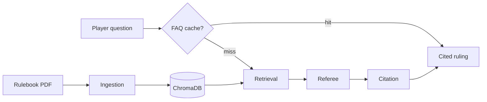

# Board Game Rules Referee

A small web app that acts as a **rules referee** for board games. Upload a rulebook PDF, ask questions during play, settle two-sided disputes, and get rulings backed by **page-level citations**.

Built as a first agent project: four connected agents, hybrid retrieval over chunked PDFs, and a deployable FastAPI + React stack.

Copyright © 2026 Katarzyna Vaňous. Released under the [MIT License](LICENSE).

**New here?** See [USAGE.md](USAGE.md) for a step-by-step guide to uploading rulebooks, asking questions, dispute mode, and reading rulings.

**Learning context engineering?** See [docs/CONTEXT_ENGINEERING.md](docs/CONTEXT_ENGINEERING.md) — a reading order, exercises, and file map for this codebase.

## Features

- **Ask mode** — plain-English rules questions with cited rulings
- **Dispute mode** — two players submit their interpretation; referee picks a side (or split/unclear) with per-player assessments
- **Conversation memory** — follow-up questions per rulebook with context
- **Clarification flow** — referee asks for missing game state when needed
- **Example questions** — starter prompts after upload, derived from the rulebook
- **FAQ cache** — instant repeat answers for identical questions (no LLM call)
- **Duplicate detection** — same PDF cannot be uploaded twice; legacy duplicates are deduped on list
- **Hybrid retrieval** — vector + keyword search with query expansion for better passage ranking
- **Retrieval telemetry** — logs retrieved vs cited pages for tuning
- **Game name detection** — title extracted from PDF text/metadata when not provided

## How it works



| Agent | Role |
|-------|------|
| **Ingestion** | Parse PDF pages, chunk by section/paragraph, index with page numbers |
| **Retrieval** | Hybrid vector + keyword search for relevant passages |
| **Referee** | Reason over passages and produce a ruling + citations |
| **Citation** | Verify cited pages/quotes match retrieved source text |

PDF pages are split by section headings and paragraphs into retrieval-sized chunks (page numbers preserved), embedded with ChromaDB's default model, and only the top-k chunks go to the LLM. Tune chunk size and top-k via `TOP_K_CHUNKS`, `CHUNK_MAX_CHARS`, and `CHUNK_MIN_CHARS` in `backend/.env`.

## Prerequisites

- Python 3.11+
- Node.js 20+
- An [Anthropic API key](https://console.anthropic.com/)

## Local setup

### Run everything (one terminal)

From the project root:

```bash
./scripts/dev.sh
```

Open http://localhost:5173 — the Vite dev server proxies `/api` to the backend on port 8000. Press Ctrl+C to stop both servers.

If you get `Address already in use`, stop any old servers first:

```bash
lsof -ti :8000,:5173 | xargs kill
```

### Backend only

```bash
cd backend
python -m venv .venv
source .venv/bin/activate
pip install -r requirements.txt
cp .env.example .env
# Edit .env and set ANTHROPIC_API_KEY

uvicorn main:app --reload --port 8000
```

Serves the built frontend at http://localhost:8000 when `frontend/dist` exists.

### Frontend only

```bash
cd frontend
npm install
npm run dev
```

Open http://localhost:5173 — the Vite dev server proxies `/api` to the backend.

## Using the app

See **[USAGE.md](USAGE.md)** for upload, ask, dispute mode, citations, clarification, follow-ups, and troubleshooting.

## API

| Method | Path | Description |
|--------|------|-------------|
| `GET` | `/api/health` | Health check (`model`, `ocr_fallback_enabled`, `tesseract_installed`, `ocr_available`, `data_dir_writable`) |
| `GET` | `/api/rulebooks` | List uploaded rulebooks |
| `POST` | `/api/rulebooks` | Upload PDF (`file`, optional `name`). Returns **409** if the same PDF is already in the library |
| `DELETE` | `/api/rulebooks/{id}` | Remove a rulebook |
| `GET` | `/api/rulebooks/{id}/examples` | Suggested starter questions for a rulebook |
| `POST` | `/api/rulebooks/{id}/ask` | Ask a question (`{"question": "...", "history": [...]}`) |
| `POST` | `/api/rulebooks/{id}/dispute` | Settle a dispute (`{"situation": "...", "player_a": "...", "player_b": "...", "history": [...]}`) |

Ask/dispute responses include `retrieval.metrics` (cited vs retrieved pages) and `cached: true` on FAQ cache hits.

## Configuration

Copy `backend/.env.example` to `backend/.env`. Key variables:

| Variable | Default | Purpose |
|----------|---------|---------|
| `ANTHROPIC_API_KEY` | — | Required for LLM rulings |
| `ANTHROPIC_MODEL` | `claude-sonnet-4-6` | Referee model |
| `TOP_K_CHUNKS` | `6` | Passages sent to the referee |
| `CHUNK_MAX_CHARS` | `600` | Max chunk size when indexing |
| `CHUNK_MIN_CHARS` | `100` | Min chunk size before flush |
| `FAQ_CACHE` | `1` | Cache repeat questions (`0` to disable) |
| `FAQ_CACHE_MAX_ENTRIES` | `100` | Max cached Q&A per rulebook |
| `RETRIEVAL_TELEMETRY` | `1` | Log retrieval metrics to JSONL (`0` to disable) |
| `OCR_FALLBACK` | `0` | OCR sparse PDF pages at upload (`1` to enable; requires [Tesseract](https://github.com/tesseract-ocr/tesseract)) |
| `OCR_LANGUAGE` | `eng` | Tesseract language code(s) |
| `OCR_DPI` | `150` | Render resolution for full-page OCR |
| `OCR_MIN_INDEXABLE_CHARS` | `80` | Try OCR when a page has fewer indexable characters |
| `API_ACCESS_KEY` | — | When set, all `/api/*` routes (except `/api/health` and `/api/config`) require `X-API-Key` or `Authorization: Bearer` |
| `DEMO_MODE` | `0` | Public demo: read-only access to pre-seeded rulebooks for anonymous users |
| `PRESEED_DEMO_RULEBOOK` | on when `DEMO_MODE=1` | Load bundled sample PDF at startup |
| `RATE_LIMIT_ENABLED` | on in production or when `API_ACCESS_KEY` is set | Per-IP rate limits on API routes (`0` to disable) |
| `RATE_LIMIT_LLM_MAX` | `30` | Max ask/dispute requests per IP per window |
| `RATE_LIMIT_LLM_WINDOW` | `3600` | LLM rate-limit window in seconds |
| `RATE_LIMIT_EXPENSIVE_MAX` | `10` | Max upload/reindex/BGG requests per IP per window |
| `RATE_LIMIT_EXPENSIVE_WINDOW` | `3600` | Expensive-operation window in seconds |
| `RATE_LIMIT_PREVIEW_MAX` | `120` | Max page-preview requests per IP per window |
| `RATE_LIMIT_PREVIEW_WINDOW` | `60` | Preview window in seconds |
| `RATE_LIMIT_DEFAULT_MAX` | `300` | Max other API requests per IP per window |
| `RATE_LIMIT_DEFAULT_WINDOW` | `60` | Default window in seconds |

For public deploys, set `API_ACCESS_KEY` and `DEMO_MODE=1` on the same instance. Share family links with `?access=YOUR_SECRET`; keep the plain URL in the README for recruiters. See [docs/DEPLOYMENT.md](docs/DEPLOYMENT.md).

## Testing

```bash
cd backend
source .venv/bin/activate
pytest
```

### E2E smoke test (Playwright)

Uploads the sample rulebook PDF, asks a question, and asserts a citation appears. Uses a stub referee (`E2E_STUB_LLM=1`) — no Anthropic API key required.

```bash
cd backend/tests/fixtures
python make_sample_pdf.py   # once, if sample-rulebook.pdf is missing

cd ../../frontend
npm install
npm run test:e2e
```

Playwright starts the backend (`scripts/e2e-backend.sh`) and Vite dev server automatically.

## Pre-commit

Git hooks run **Ruff** (lint + format) on the backend and **ESLint** on the frontend before each commit:

```bash
pip install -r backend/requirements-dev.txt
pre-commit install
```

Run all hooks manually:

```bash
pre-commit run --all-files
```

### Retrieval telemetry

Each ask/dispute logs retrieval metrics to `data/retrieval_telemetry.jsonl` (retrieved vs cited pages, citation pass rate). Adjust `TOP_K_CHUNKS`, `CHUNK_MAX_CHARS`, and `CHUNK_MIN_CHARS` in `.env` based on what you see in the agent trace and telemetry log.

### FAQ cache

Repeat questions with no conversation history are answered from a per-rulebook cache (`data/faq_cache/`) — no LLM call. Set `FAQ_CACHE=0` to disable.

## Deploy

**Recommended:** one cloud deploy with a **persistent disk** — public demo for recruiters + full access for you and family via `?access=SECRET`, works across devices.

→ **[docs/DEPLOYMENT.md](docs/DEPLOYMENT.md)** (step-by-step Fly.io / Render)

| Link | Who | What |
|------|-----|------|
| `https://your-app.example.com` | Recruiters (README) | Sample game, ask / search / dispute |
| `https://your-app.example.com/?access=SECRET` | You, family (bookmark, not in README) | Upload rulebooks, shared library on all devices |

Template: [`deploy/hybrid.env.example`](deploy/hybrid.env.example) · Blueprint: [`render.yaml`](render.yaml)

```bash
cp deploy/hybrid.env.example deploy/hybrid.env   # set keys
docker compose -f docker-compose.hybrid.yml --env-file deploy/hybrid.env up --build
```

**Local dev** (no cloud): `./scripts/dev.sh` — data in `backend/data/`.

Alternatives (demo-only, personal-only, two deploys): see [docs/DEPLOYMENT.md](docs/DEPLOYMENT.md#alternative-setups).

## Project layout

```
board-game-referee/
├── backend/
│   ├── agents/
│   │   ├── ingestion_agent.py
│   │   ├── retrieval_agent.py
│   │   ├── referee_agent.py
│   │   ├── citation_agent.py
│   │   └── pipeline.py          # connects all agents
│   ├── services/
│   │   ├── pdf_parser.py
│   │   ├── vector_store.py      # hybrid retrieval
│   │   ├── rulebook_store.py
│   │   ├── faq_cache.py
│   │   └── retrieval_telemetry.py
│   └── main.py
├── frontend/
│   └── src/
│       ├── App.tsx
│       ├── app/                 # types + sidebar helpers
│       ├── components/          # extracted UI panels
│       ├── api.ts
│       └── Icons.tsx
└── scripts/
    └── dev.sh
```

## Ideas to try next

- Clickable citations — jump to source excerpts in a drawer or modal
- Multi-rulebook search — "Which of my games allows this?"
- CI with GitHub Actions
- Mobile-friendly layout for use at the table
- Swap ChromaDB for a hosted vector DB when you deploy at scale
