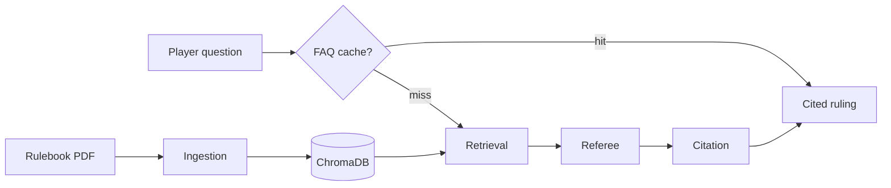

# Board Game Rules Referee

A small web app that acts as a **rules referee** for board games. Upload a rulebook PDF, ask questions during play, settle two-sided disputes, and get rulings backed by **page-level citations**.

Built as a first agent project: four connected agents, hybrid retrieval over chunked PDFs, and a deployable FastAPI + React stack.

Copyright © 2026 Katarzyna Vaňous. Released under the [MIT License](LICENSE).

**New here?** See [USAGE.md](USAGE.md) for a step-by-step guide to uploading rulebooks, asking questions, dispute mode, and reading rulings.

## Features

- **Ask mode** — plain-English rules questions with cited rulings
- **Dispute mode** — two players submit their interpretation; referee picks a side (or split/unclear) with per-player assessments
- **Conversation memory** — follow-up questions per rulebook with context
- **Clarification flow** — referee asks for missing game state when needed
- **Example questions** — starter prompts after upload, derived from the rulebook
- **FAQ cache** — instant repeat answers for identical questions (no LLM call)
- **Duplicate detection** — same PDF cannot be uploaded twice; legacy duplicates are deduped on list
- **Hybrid retrieval** — vector + keyword search with query expansion for better passage ranking
- **Retrieval telemetry** — logs retrieved vs cited pages for tuning
- **Game name detection** — title extracted from PDF text/metadata when not provided

## How it works



| Agent | Role |
|-------|------|
| **Ingestion** | Parse PDF pages, chunk by section/paragraph, index with page numbers |
| **Retrieval** | Hybrid vector + keyword search for relevant passages |
| **Referee** | Reason over passages and produce a ruling + citations |
| **Citation** | Verify cited pages/quotes match retrieved source text |

PDF pages are split by section headings and paragraphs into retrieval-sized chunks (page numbers preserved), embedded with ChromaDB's default model, and only the top-k chunks go to the LLM. Tune chunk size and top-k via environment variables or `scripts/tune_retrieval.py`.

## Prerequisites

- Python 3.11+
- Node.js 20+
- An [Anthropic API key](https://console.anthropic.com/)

## Local setup

### Run everything (one terminal)

From the project root:

```bash
./scripts/dev.sh
```

Open http://localhost:5173 — the Vite dev server proxies `/api` to the backend on port 8000. Press Ctrl+C to stop both servers.

If you get `Address already in use`, stop any old servers first:

```bash
lsof -ti :8000,:5173 | xargs kill
```

### Backend only

```bash
cd backend
python -m venv .venv
source .venv/bin/activate
pip install -r requirements.txt
cp .env.example .env
# Edit .env and set ANTHROPIC_API_KEY

uvicorn main:app --reload --port 8000
```

Serves the built frontend at http://localhost:8000 when `frontend/dist` exists.

### Frontend only

```bash
cd frontend
npm install
npm run dev
```

Open http://localhost:5173 — the Vite dev server proxies `/api` to the backend.

## Using the app

See **[USAGE.md](USAGE.md)** for upload, ask, dispute mode, citations, clarification, follow-ups, and troubleshooting.

## API

| Method | Path | Description |
|--------|------|-------------|
| `GET` | `/api/health` | Health check |
| `GET` | `/api/rulebooks` | List uploaded rulebooks (dedupes legacy copies) |
| `POST` | `/api/rulebooks` | Upload PDF (`file`, optional `name`). Returns **409** if the same PDF is already in the library |
| `DELETE` | `/api/rulebooks/{id}` | Remove a rulebook |
| `GET` | `/api/rulebooks/{id}/examples` | Suggested starter questions for a rulebook |
| `POST` | `/api/rulebooks/{id}/ask` | Ask a question (`{"question": "...", "history": [...]}`) |
| `POST` | `/api/rulebooks/{id}/dispute` | Settle a dispute (`{"situation": "...", "player_a": "...", "player_b": "...", "history": [...]}`) |

Ask/dispute responses include `retrieval.metrics` (cited vs retrieved pages) and `cached: true` on FAQ cache hits.

## Configuration

Copy `backend/.env.example` to `backend/.env`. Key variables:

| Variable | Default | Purpose |
|----------|---------|---------|
| `ANTHROPIC_API_KEY` | — | Required for LLM rulings |
| `ANTHROPIC_MODEL` | `claude-sonnet-4-6` | Referee model |
| `TOP_K_CHUNKS` | `6` | Passages sent to the referee |
| `CHUNK_MAX_CHARS` | `600` | Max chunk size when indexing |
| `CHUNK_MIN_CHARS` | `100` | Min chunk size before flush |
| `FAQ_CACHE` | `1` | Cache repeat questions (`0` to disable) |
| `FAQ_CACHE_MAX_ENTRIES` | `100` | Max cached Q&A per rulebook |
| `RETRIEVAL_TELEMETRY` | `1` | Log retrieval metrics to JSONL (`0` to disable) |

## Testing

```bash
cd backend
source .venv/bin/activate
pytest
```

### Tune retrieval

Each ask/dispute logs retrieval metrics to `data/retrieval_telemetry.jsonl` (retrieved vs cited pages, citation pass rate). Summarize live usage:

```bash
cd backend
python scripts/tune_retrieval.py --summarize-log
```

Sweep chunk size and top-k against the sample rulebook benchmark (no API key needed):

```bash
python scripts/tune_retrieval.py
```

Override `TOP_K_CHUNKS`, `CHUNK_MAX_CHARS`, and `CHUNK_MIN_CHARS` based on the best row.

### FAQ cache

Repeat questions with no conversation history are answered from a per-rulebook cache (`data/faq_cache/`) — no LLM call. Set `FAQ_CACHE=0` to disable.

## Deploy

**Backend** (Render, Railway, Fly.io, etc.):

- Root: `backend/` or use the included **Docker** setup
- Start command: `uvicorn main:app --host 0.0.0.0 --port $PORT`
- Set `ANTHROPIC_API_KEY` and `CORS_ORIGINS` (your frontend URL)
- Attach a persistent volume at `DATA_DIR` so uploads, cache, and ChromaDB survive restarts

**Frontend** (Vercel, Netlify, Cloudflare Pages):

```bash
cd frontend
VITE_API_URL=https://your-api.example.com npm run build
```

Deploy the `dist/` folder. Set `VITE_API_URL` to your backend URL at build time.

Or use the included Docker setup for a single-host deploy:

```bash
docker compose up --build
```

## Project layout

```
board-game-referee/
├── backend/
│   ├── agents/
│   │   ├── ingestion_agent.py
│   │   ├── retrieval_agent.py
│   │   ├── referee_agent.py
│   │   ├── citation_agent.py
│   │   └── pipeline.py          # connects all agents
│   ├── services/
│   │   ├── pdf_parser.py
│   │   ├── vector_store.py      # hybrid retrieval
│   │   ├── rulebook_store.py
│   │   ├── faq_cache.py
│   │   ├── retrieval_telemetry.py
│   │   └── retrieval_benchmark.py
│   ├── scripts/
│   │   └── tune_retrieval.py
│   └── main.py
├── frontend/
│   └── src/
│       ├── App.tsx
│       ├── api.ts
│       └── Icons.tsx
└── scripts/
    └── dev.sh
```

## Ideas to try next

- Clickable citations — jump to source excerpts in a drawer or modal
- Multi-rulebook search — "Which of my games allows this?"
- CI with GitHub Actions
- Mobile-friendly layout for use at the table
- Swap ChromaDB for a hosted vector DB when you deploy at scale
