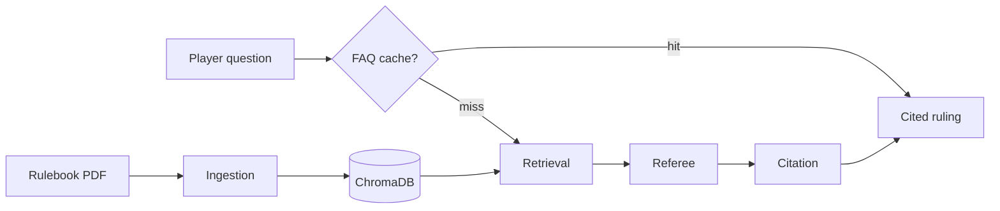

# Board Game Rules Referee

A small web app that acts as a **rules referee** for board games. Upload a rulebook PDF, ask questions during play, settle two-sided disputes, and get rulings backed by **page-level citations**.

Built as a first agent project: four connected agents, hybrid retrieval over chunked PDFs, and a deployable FastAPI + React stack.

Copyright © 2026 Katarzyna Vaňous. Released under the [MIT License](LICENSE).

**New here?** See [USAGE.md](USAGE.md) for a step-by-step guide to uploading rulebooks, asking questions, dispute mode, and reading rulings.

**Learning context engineering?** See [docs/CONTEXT_ENGINEERING.md](docs/CONTEXT_ENGINEERING.md) — a reading order, exercises, and file map for this codebase.

## Live demo

**Public (recruiters, README):** [https://board-game-referee.onrender.com](https://board-game-referee.onrender.com)

- Pre-loaded sample game — **Ask**, **Search**, and **Dispute** work without signing in
- No uploads on the public link (demo is read-only)
- First load after idle may take ~30–60s (free-tier cold start)

**Family / full access (private bookmark — do not share in README or git):**

```
https://board-game-referee.onrender.com/?access=YOUR_API_ACCESS_KEY
```

- Upload rulebooks, pin/delete games, re-scan PDFs
- Same URL on phone and laptop; chat history stays per browser
- On the current free Render deploy, uploaded PDFs may not survive a server restart — re-upload if the library is empty

Set `API_ACCESS_KEY` in Render environment variables. Generate one with `openssl rand -hex 32`.

Full deploy options (hybrid, demo-only, persistent disk): **[docs/DEPLOYMENT.md](docs/DEPLOYMENT.md)**

## Features

- **Ask mode** — plain-English rules questions with cited rulings
- **Search mode** — keyword search over indexed passages (no LLM call)
- **Dispute mode** — two players submit their interpretation; referee picks a side (or split/unclear) with per-player assessments
- **Conversation memory** — follow-up questions per rulebook with context
- **Clarification flow** — referee asks for missing game state when needed
- **Example questions** — starter prompts after upload, derived from the rulebook
- **FAQ cache** — instant repeat answers for identical questions (no LLM call)
- **Duplicate detection** — same PDF cannot be uploaded twice; legacy duplicates are deduped on list
- **Hybrid retrieval** — vector + keyword search with query expansion for better passage ranking
- **Page previews** — tap a citation to see the PDF page and excerpt
- **Game name detection** — title extracted from PDF text/metadata when not provided
- **Hybrid demo deploy** — public sample game + full access via `?access=` on one URL

## How it works



| Agent | Role |
|-------|------|
| **Ingestion** | Parse PDF pages, chunk by section/paragraph, index with page numbers |
| **Retrieval** | Hybrid vector + keyword search for relevant passages |
| **Referee** | Reason over passages and produce a ruling + citations |
| **Citation** | Verify cited pages/quotes match retrieved source text |

PDF pages are split by section headings and paragraphs into retrieval-sized chunks (page numbers preserved), embedded with ChromaDB's default model, and only the top-k chunks go to the LLM. Tune chunk size and top-k via `TOP_K_CHUNKS`, `CHUNK_MAX_CHARS`, and `CHUNK_MIN_CHARS` in `backend/.env`.

## Prerequisites

- Python 3.11+
- Node.js 20+
- An [Anthropic API key](https://console.anthropic.com/) (not needed for local E2E smoke tests)

## Local setup

### Run everything (one terminal)

From the project root:

```bash
./scripts/dev.sh
```

Open http://localhost:5173 — the Vite dev server proxies `/api` to the backend on port 8000. Press Ctrl+C to stop both servers.

If you get `Address already in use`, stop any old servers first:

```bash
lsof -ti :8000 | xargs kill; lsof -ti :5173 | xargs kill
```

### Backend only

```bash
cd backend
python -m venv .venv
source .venv/bin/activate
pip install -r requirements.txt
cp .env.example .env
# Edit .env and set ANTHROPIC_API_KEY

uvicorn main:app --reload --port 8000
```

Serves the built frontend at http://localhost:8000 when `frontend/dist` exists.

### Frontend only

```bash
cd frontend
npm install
npm run dev
```

Open http://localhost:5173 — the Vite dev server proxies `/api` to the backend.

### Agent trace (local dev only)

When running `./scripts/dev.sh` or `npm run dev`, each ruling includes a collapsible **Agent trace** with retrieval pages and the full API JSON. This is hidden in production builds — use it for debugging and [context-engineering exercises](docs/CONTEXT_ENGINEERING.md).

## Using the app

See **[USAGE.md](USAGE.md)** for upload, ask, search, dispute mode, citations, clarification, follow-ups, and troubleshooting.

## API

| Method | Path | Description |
|--------|------|-------------|
| `GET` | `/api/health` | Health check |
| `GET` | `/api/config` | `demo_mode`, `full_access`, `auth_required` |
| `GET` | `/api/rulebooks` | List rulebooks (demo-filtered for anonymous users) |
| `POST` | `/api/rulebooks/upload-stream` | Upload PDF with progress (SSE) |
| `DELETE` | `/api/rulebooks/{id}` | Remove a rulebook |
| `POST` | `/api/rulebooks/{id}/reindex-stream` | Re-scan stored PDF |
| `GET` | `/api/rulebooks/{id}/examples` | Suggested starter questions |
| `POST` | `/api/rulebooks/{id}/ask` | Ask a question |
| `POST` | `/api/rulebooks/{id}/dispute` | Settle a dispute |
| `POST` | `/api/rulebooks/{id}/search` | Quick search (no LLM) |
| `POST` | `/api/rulebooks/bgg/lookup` | Look up rulebook files on BoardGameGeek |

Ask/dispute responses include `retrieval.metrics` and `cached: true` on FAQ cache hits.

## Configuration

Copy `backend/.env.example` to `backend/.env`. Key variables:

| Variable | Default | Purpose |
|----------|---------|---------|
| `ANTHROPIC_API_KEY` | — | Required for LLM rulings |
| `ANTHROPIC_MODEL` | `claude-sonnet-4-6` | Referee model |
| `TOP_K_CHUNKS` | `6` | Passages sent to the referee |
| `CHUNK_MAX_CHARS` | `600` | Max chunk size when indexing |
| `CHUNK_MIN_CHARS` | `100` | Min chunk size before flush |
| `FAQ_CACHE` | `1` | Cache repeat questions (`0` to disable) |
| `RETRIEVAL_TELEMETRY` | `1` locally | Log retrieval metrics to JSONL (`0` in production deploy) |
| `OCR_FALLBACK` | `0` | OCR sparse PDF pages at upload (`1` + Tesseract) |
| `API_ACCESS_KEY` | — | Family access via `?access=` or `X-API-Key` |
| `DEMO_MODE` | `0` | Public demo: sample game for anonymous users |
| `PRESEED_DEMO_RULEBOOK` | on when `DEMO_MODE=1` | Load bundled sample PDF at startup |
| `CORS_ORIGINS` | `http://localhost:5173` | Allowed frontend origin(s), comma-separated |
| `RATE_LIMIT_*` | see `.env.example` | Per-IP rate limits |

For cloud hybrid deploy: `DEMO_MODE=1`, `API_ACCESS_KEY` set, `CORS_ORIGINS` = your Render/Fly URL. See [docs/DEPLOYMENT.md](docs/DEPLOYMENT.md).

## Testing

### Backend

```bash
cd backend
source .venv/bin/activate
pytest
```

### Frontend

```bash
cd frontend
npm run lint
npm run build
```

### E2E smoke test (Playwright)

Uploads the sample rulebook, asks a question, and asserts a citation appears. Uses a stub referee (`E2E_STUB_LLM=1`) — no Anthropic API key required.

```bash
cd backend/tests/fixtures
python make_sample_pdf.py   # once, if sample-rulebook.pdf is missing

cd ../../frontend
npm install
npm run test:e2e
```

### CI (GitHub Actions)

Every push to `main` runs two workflows:

| Workflow | What it checks |
|----------|----------------|
| **CI** | Backend `pytest` + frontend lint/build |
| **E2E** | Playwright smoke test |

## Pre-commit

```bash
pip install -r backend/requirements-dev.txt
pre-commit install
pre-commit run --all-files
```

## Deploy

| Link | Who | What |
|------|-----|------|
| [board-game-referee.onrender.com](https://board-game-referee.onrender.com) | Public | Sample game — ask / search / dispute |
| `…?access=SECRET` (bookmark) | Family | Upload rulebooks, full app |

**Templates:** [`deploy/hybrid.env.example`](deploy/hybrid.env.example) · [`render.yaml`](render.yaml)

**Local Docker (hybrid):**

```bash
cp deploy/hybrid.env.example deploy/hybrid.env   # set keys
docker compose -f docker-compose.hybrid.yml --env-file deploy/hybrid.env up --build
```

- Public demo: http://localhost:8000
- Full access: http://localhost:8000/?access=YOUR_API_ACCESS_KEY

Step-by-step Render / Fly.io guide: **[docs/DEPLOYMENT.md](docs/DEPLOYMENT.md)**

## Project layout

```
board-game-referee/
├── backend/
│   ├── agents/          # ingestion, retrieval, referee, citation, pipeline
│   ├── services/        # PDF, vector store, FAQ cache, demo mode, …
│   └── main.py
├── frontend/
│   └── src/
│       ├── App.tsx      # main UI orchestration
│       ├── app/         # types + helpers
│       ├── components/  # referee answer, search, notices, …
│       └── api.ts
├── .github/workflows/   # CI + E2E
├── deploy/              # env templates
└── scripts/dev.sh
```

## Ideas to try next

- Multi-rulebook search — "Which of my games allows this?"
- Persistent disk on Render for family uploads that survive restarts
- Swap ChromaDB for a hosted vector DB at scale
