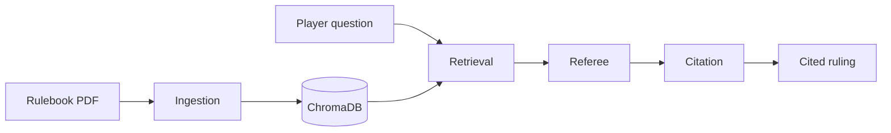

# Board Game Rules Referee

A small web app that acts as a **rules referee** for board games. Upload a rulebook PDF, ask questions during play, and get rulings backed by **page-level citations**.

Built as a first agent project: four connected agents, retrieval over chunked PDFs, and a deployable FastAPI + React stack.

**New here?** See [USAGE.md](USAGE.md) for a step-by-step guide to uploading rulebooks, asking questions, and reading rulings.

## How it works



| Agent | Role |
|-------|------|
| **Ingestion** | Parse PDF pages, index text with page numbers |
| **Retrieval** | Find the most relevant passages for a question |
| **Referee** | Reason over passages and produce a ruling + citations |
| **Citation** | Verify cited pages/quotes match retrieved source text |

This is intentionally a playground for **context engineering**: PDF pages are split by section headings and paragraphs into retrieval-sized chunks (with page numbers preserved), embedded with ChromaDB's default model, and only the top-k chunks go to the LLM. You can experiment with chunk size, top-k, and prompts without touching the rest of the app.

## Prerequisites

- Python 3.11+
- Node.js 20+
- An [Anthropic API key](https://console.anthropic.com/)

## Local setup

### Run everything (one terminal)

From the project root:

```bash
./scripts/dev.sh
```

Open http://localhost:5173 — the Vite dev server proxies `/api` to the backend on port 8000. Press Ctrl+C to stop both servers.

If you get `Address already in use`, stop any old servers first:

```bash
lsof -ti :8000,:5173 | xargs kill
```

### Backend only

```bash
cd backend
python -m venv .venv
source .venv/bin/activate
pip install -r requirements.txt
cp .env.example .env
# Edit .env and set ANTHROPIC_API_KEY

uvicorn main:app --reload --port 8000
```

### Frontend only

```bash
cd frontend
npm install
npm run dev
```

Open http://localhost:5173 — the Vite dev server proxies `/api` to the backend.

## Using the app

See **[USAGE.md](USAGE.md)** for how to upload rulebooks, ask questions, read citations, and use the clarification flow.

## API

| Method | Path | Description |
|--------|------|-------------|
| `GET` | `/api/health` | Health check |
| `GET` | `/api/rulebooks` | List uploaded rulebooks |
| `POST` | `/api/rulebooks` | Upload PDF (`file`, optional `name`) |
| `DELETE` | `/api/rulebooks/{id}` | Remove a rulebook |
| `POST` | `/api/rulebooks/{id}/ask` | Ask a question (`{"question": "...", "history": [{"role": "user", "content": "..."}, ...]}`) |

## Testing

```bash
cd backend
source .venv/bin/activate
pytest
```

The citation agent has unit tests — a good starting point for "did it cite the right page?" assertions.

## Deploy

**Backend** (Render, Railway, Fly.io, etc.):

- Root: `backend/`
- Start command: `uvicorn main:app --host 0.0.0.0 --port $PORT`
- Set `ANTHROPIC_API_KEY` and `CORS_ORIGINS` (your frontend URL)
- Attach a persistent volume at `DATA_DIR` so uploads survive restarts

**Frontend** (Vercel, Netlify, Cloudflare Pages):

```bash
cd frontend
VITE_API_URL=https://your-api.example.com npm run build
```

Deploy the `dist/` folder. Set `VITE_API_URL` to your backend URL at build time.

Or use the included Docker setup for a single-host deploy:

```bash
docker compose up --build
```

## Project layout

```
board-game-referee/
├── backend/
│   ├── agents/
│   │   ├── ingestion_agent.py
│   │   ├── retrieval_agent.py
│   │   ├── referee_agent.py
│   │   ├── citation_agent.py
│   │   └── pipeline.py          # connects all agents
│   ├── services/
│   │   ├── pdf_parser.py
│   │   ├── vector_store.py
│   │   └── rulebook_store.py
│   └── main.py
└── frontend/
    └── src/App.tsx
```

## Ideas to try next

- Add a "dispute mode" that takes two players' arguments
- Log questions + rulings and score citation accuracy over time
- Swap ChromaDB for a hosted vector DB when you deploy
