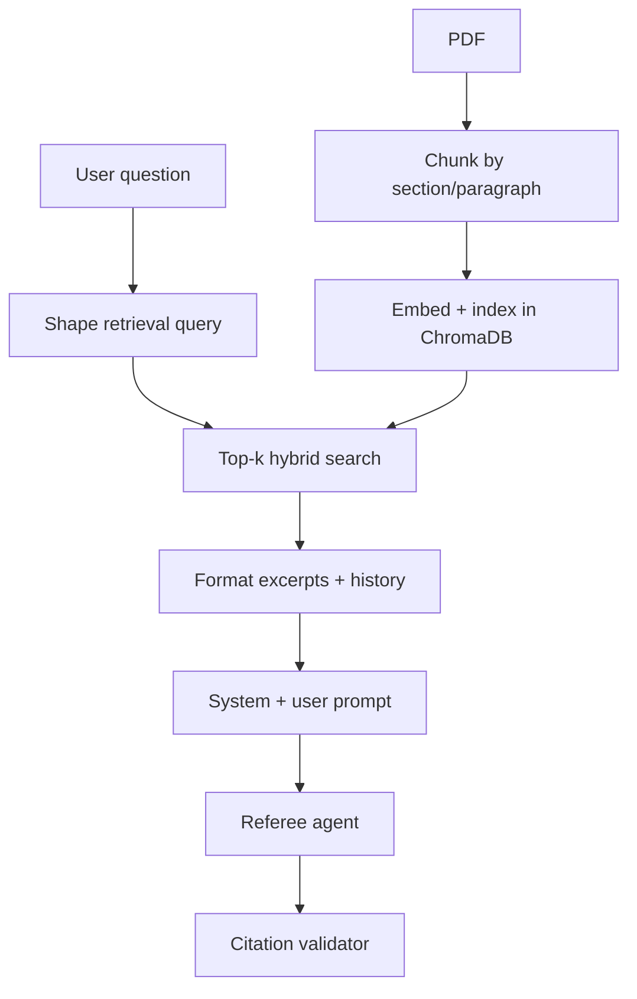

# Learning context engineering from this project

This app is a small **context engineering lab**: you control what the LLM sees (chunk → retrieve → pack → instruct → verify), not the whole rulebook.

> **Core idea:** The model only answers from the passages you put in the prompt. If the right text is not in the top-k chunks, it cannot cite it honestly.

---

## The pipeline



**Orchestration:** `backend/agents/pipeline.py` — start here once you know the pieces.

---

## Read in this order

### 1. Chunking — what gets indexed

| | |
|---|---|
| **File** | `backend/services/pdf_parser.py` |
| **Read** | `chunk_page_text()`, `extract_chunks()`, `_is_heading()` |
| **Concepts** | Chunk size, page/section metadata, structure-aware splits |
| **Knobs** | `CHUNK_MAX_CHARS`, `CHUNK_MIN_CHARS` in `backend/config.py` |

Too-large chunks add noise; too-small chunks lose surrounding rules.

### 2. Retrieval — what gets selected

| | |
|---|---|
| **Files** | `backend/services/vector_store.py`, `backend/agents/retrieval_agent.py` |
| **Read** | `search()`, `_query_terms()`, term expansion |
| **Concepts** | Hybrid vector + keyword search, stop words, top-k limit |
| **Knobs** | `TOP_K_CHUNKS` |

Wrong passages → confident wrong answers. Retrieval quality often matters more than model choice.

### 3. Query shaping — before search

| | |
|---|---|
| **File** | `backend/services/conversation.py` |
| **Read** | `retrieval_query()`, `format_history_block()`, `trim_history()` |
| **Concepts** | Follow-ups need prior questions in the search query; history cap (`MAX_HISTORY_MESSAGES = 12`) |

### 4. Prompt packing — what the LLM sees

| | |
|---|---|
| **File** | `backend/agents/referee_agent.py` |
| **Read** | `SYSTEM_PROMPT`, `DISPUTE_SYSTEM_PROMPT`, `_format_context()`, `rule_on()` |
| **Concepts** | System contract, excerpt formatting `[Page N — Section]`, structured JSON output |

Example user message shape:

```
Conversation so far:
Player: Can I attack on my turn?
Referee: Yes, during the attack phase.

Current question: What about on the first turn?

Rulebook excerpts:

[Page 2 — Turn Order]
You may not attack on the first turn.

---
[Page 3 — Combat]
...
```

### 5. Verification — did it work?

| | |
|---|---|
| **Files** | `backend/agents/citation_agent.py`, `backend/services/retrieval_telemetry.py` |
| **Concepts** | Cited page in retrieval? Quote grounded in chunk text? `citation_recall`, `citation_pass_rate` |
| **Logs** | `data/retrieval_telemetry.jsonl` |

---

## What is / isn't context engineering here

| Piece | Context engineering? |
|-------|----------------------|
| Chunking, retrieval, prompts, history | Yes — core |
| Citation validation | Yes — feedback loop |
| Retrieval telemetry | Yes — experimentation |
| FAQ cache | No — cost/latency optimization |
| Duplicate PDF detection | No — product logic |

---

## Hands-on exercises

### Exercise A — Trace one question (15 min)

1. Upload a rulebook, ask a specific question.
2. Expand **Agent trace** in the UI — note `retrieval.pages` and citations.
3. Read `pipeline.py` → `referee_agent.py` and match code to the trace.

### Exercise B — Break retrieval on purpose (10 min)

1. Set `TOP_K_CHUNKS=2` in `backend/.env`, restart backend.
2. Ask the same question again.
3. Did the right page still appear? Did the ruling change?

**Lesson:** If the right page drops out of top-k, answers degrade.

### Exercise C — Inspect telemetry

Ask several questions in the app, then read `backend/data/retrieval_telemetry.jsonl`. Low `citation_recall` → increase top-k or fix chunking. Low `citation_pass_rate` → retrieval or prompt issue.

### Exercise D — Prompt edit

Change one line in `SYSTEM_PROMPT` (e.g. prefer the stricter reading when ambiguous). Restart, test edge cases, compare citations.

---

## Suggested learning path

| Step | Action | Learn |
|------|--------|-------|
| 1 | Agent trace + `pipeline.py` | End-to-end flow |
| 2 | `TOP_K_CHUNKS` env + agent trace | Retrieval vs answer quality |
| 3 | Edit `SYSTEM_PROMPT` | Prompt design |
| 4 | `test_retrieval_telemetry.py` | Measuring retrieval |

---

## Tests to study

```bash
cd backend
pytest tests/test_integration.py -v    # ingest + retrieve, no LLM
pytest tests/test_vector_store.py -v   # hybrid search behavior
pytest tests/test_referee_agent.py -v  # prompt contents
pytest tests/test_citation_agent.py -v # validation rules
```

| Test file | Teaches |
|-----------|---------|
| `test_vector_store.py` | Keyword boost, hybrid hits |
| `test_integration.py` | Ingest + retrieve without LLM |
| `test_referee_agent.py` | What lands in the prompt |
| `test_citation_agent.py` | When citations fail |
| `test_retrieval_telemetry.py` | Measuring context quality |

---

## Personal notes

- **This file** — learning guide, safe to commit and share.
- **`TODO.local.md`** (project root) — private backlog, gitignored. Good for your own experiments and “what I tried” notes.
- **Agent trace** (UI) — per-question snapshot of retrieval + full API response.

---

## Graphical / layout-heavy PDFs

Some rulebooks (tight columns, icons, player boards in the PDF) extract poorly as plain text. You may see headings like **Choose Actions** with body text that is only `"2"` (a page number) — retrieval sends junk to the LLM and you get honest but useless answers.

### Option A — Text-based PDF (try this first)

Best fix, no code changes:

1. Check the publisher site or BoardGameGeek **Files** for a “rulebook”, “rules reference”, or “learn to play” PDF (often more text-heavy than the glossy manual).
2. Open the PDF and try selecting a sentence with your cursor. If you **can’t select real paragraph text**, the app will struggle too.
3. Delete the game in the app and **re-upload** the better PDF.

### Option B — OCR (optional)

When pages are scanned or text is baked into images, enable OCR at ingest time:

| Piece | Approach |
|-------|----------|
| Engine | [Tesseract](https://github.com/tesseract-ocr/tesseract) via PyMuPDF `page.get_textpage_ocr()` |
| When | Per page, only if normal extraction yields almost no indexable text |
| Cost | Slower uploads; needs `tesseract` installed on the server (`brew install tesseract` on macOS) |
| Config | `OCR_FALLBACK=1` in `.env` (off by default); set `OCR_LANGUAGE`, `OCR_DPI`, or `OCR_MIN_INDEXABLE_CHARS` as needed |

Tradeoffs: OCR adds dependencies and latency; accuracy on stylized fonts and tables is imperfect. Prefer a text PDF when you can.

### Diagnose before tuning prompts

1. Ask a question → expand **Agent trace** → `retrieval.sources`.
2. If excerpts are headers, numbers, or component lists, **fix ingestion** (better PDF or OCR), not the referee prompt.
3. After re-uploading, use **New conversation** so FAQ cache does not return an old answer.

---

## Further reading in-repo

- [USAGE.md](../USAGE.md) — using the app at the table
- [README.md](../README.md) — setup, API, configuration
- `backend/.env.example` — all tunable env vars
